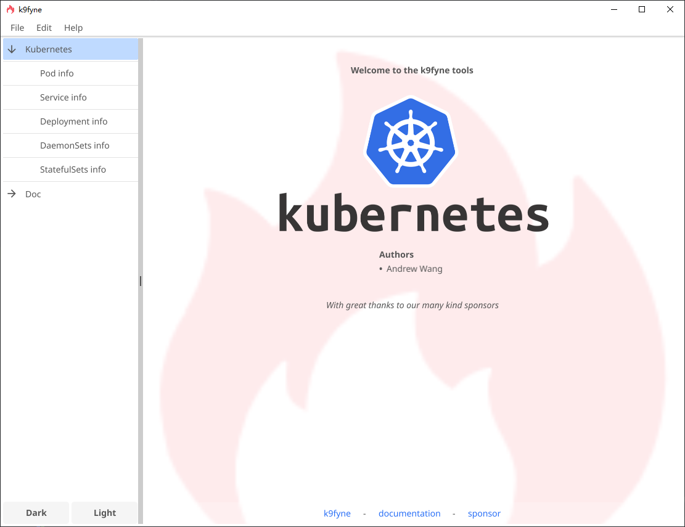

# k9fyne
#### k9fyne - A Kubernetes Management Tool Using Fyne Framework



Welcome to **k9fyne**, a powerful and user-friendly tool for managing your Kubernetes clusters. Built using the Fyne framework, k9fyne provides an intuitive graphical interface that simplifies the management of Kubernetes resources.

---

#### Features

- **Pod Information**: View detailed information about all pods in your cluster.
- **Service Information**: Manage and inspect services running within your Kubernetes environment.
- **Deployment Information**: Monitor and control deployments to ensure smooth application rollouts.
- **DaemonSets Information**: Get insights into DaemonSets, ensuring critical system components are always running.
- **StatefulSets Information**: Manage StatefulSets for stateful applications with persistent storage needs.
- **Documentation**: Access comprehensive documentation directly from the app for quick reference.
- **Dark/Light Mode**: Switch between dark and light themes for optimal viewing comfort.

---

#### Getting Started

1. **Installation**:
    - Clone the repository: `git clone https://github.com/yourusername/k9fyne.git`
    - Build the application: `go build -o k9fyne main.go`

2. **Handling Dependencies**
   - If you are using a proxy within China, you can disable GOSUM verification:
      ```bash
      go env -w GOPROXY=https://goproxy.cn,direct
      go env -w GOSUMDB=off
      ```
     This will disable module hash database verification and is suitable for trusted network environments or development/debugging purposes.

3. **Usage**:
    - Run the application: `./k9fyne`
    - Connect to your Kubernetes cluster by configuring the necessary credentials.
    - Navigate through the menu options to manage different Kubernetes resources.

---

#### Authors

- Andrew Wang

With great thanks to our many kind sponsors.

---

#### Documentation & Sponsor

- [Documentation](#)
- [Sponsor](#)
